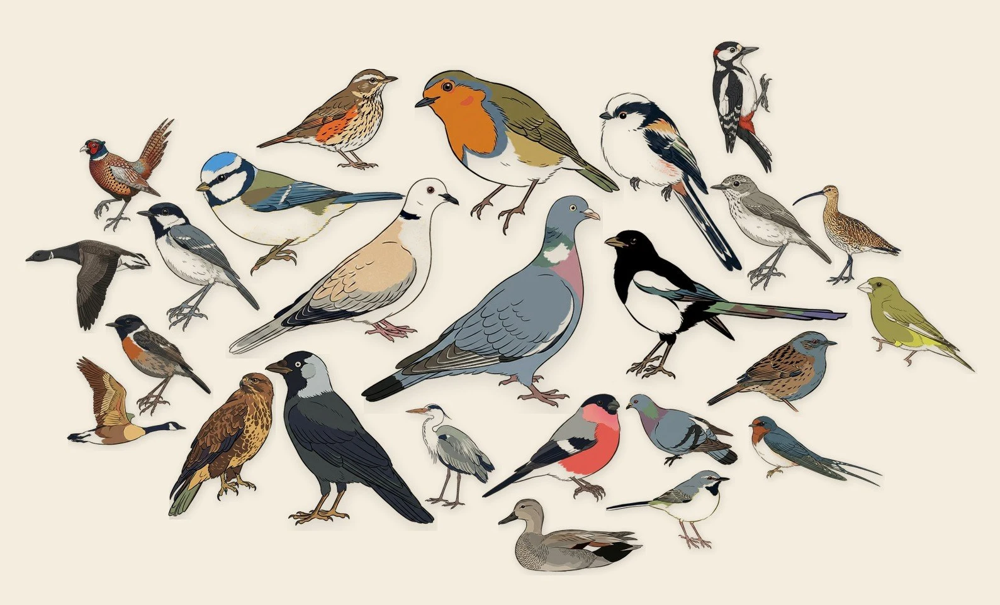

# Birdy

A local desktop wallpaper that shows what birds have actually been heard
near you recently — pulled from [BirdWeather](https://app.birdweather.com)'s
public community station network, rendered as an overlapping flock collage
in the style of [AvianVisitors](https://github.com/Twarner491/AvianVisitors),
and set directly as your desktop background (Windows, and via packaging helpers on Ubuntu/Linux and macOS).

[BirdNET-Pi](https://github.com/Nachtzuster/BirdNET-Pi)/AvianVisitors-style
setups are genuinely great, but they need a Raspberry Pi and a mic pointed
out a window. Birdy exists so anyone on a desktop can get the same
"what's been heard nearby, as art on my screen" result with none of that —
no hardware, no soldering, no always-on device — by leaning on BirdWeather's
existing public station network instead of running your own. It started as
a "phase 0" preview while waiting on hardware for a proper BirdNET-Pi build,
and turned into its own thing worth sharing on its own.



## What it does

1. Looks up your postcode → lat/lon (via the free
   [postcodes.io](https://postcodes.io) API)
2. Queries BirdWeather's public GraphQL API for recent detections near you
3. Renders a static HTML preview page (handy for just browsing in a tab)
4. Renders a flock-style collage as a JPG and sets it as your actual desktop
   wallpaper — sized to your real screen resolution, no third-party
   wallpaper app involved

## Setup

### The easy way: Birdy.exe (recommended for most people)

No Python install, no editing config files by hand. Grab the latest
`Birdy.exe` from the [Releases page](../../releases), put it in a permanent
folder (e.g. `Documents\Birdy`), and double-click it.

The first launch runs a short one-time setup: it asks for your postcode,
whether to show the "Garden Visitors" title above the collage, whether to
show each bird's species name underneath it, offers to download ready-made
illustrations for birds already detected near you from the free
[AvianAssets](https://github.com/jonnywright/AvianAssets) UK pack (see
[Importing UK illustrations from AvianAssets](#importing-uk-illustrations-from-avianassets)
— this does that step for you too, no need to run the script by hand), and
offers to register the 15-minute auto-refresh for you (see
[Running it automatically](#running-it-automatically) — this does that step
for you via `schtasks`, no manual Task Scheduler work needed). It also seeds
an `Illustrations/` folder next to the exe with this repo's bundled bird art,
which you can add your own images to at any time (see below). Every later
double-click (or scheduled run) just refreshes the wallpaper silently — no
window, no prompts.

Settings after first-run live in `config.ini` next to the exe. Prefer the
reopenable settings GUI (`Birdy.exe --settings`, or
`python birdweather_local.py --settings`, or `packaging/open_settings`) —
or edit `config.ini` with any text editor, save, and rerun (delete the
whole file instead to get the setup wizard back). Available keys:

| Key | Default | What it does |
|---|---|---|
| `postcode` | your postcode | Set to blank to use the fallback lat/lon below it |
| `radius_km` | `20` | How far around your postcode to search |
| `days` | `1` | How many days back to search |
| `hours` | *(blank)* | Overrides `days` with a sub-day window when set — `6`, `12`, `1`, etc. |
| `show_title` | `true` | Show a title above the collage |
| `title_text` | `Garden Visitors` | What that title reads, if shown |
| `show_labels` | `false` | Show a label under each bird |
| `label_style` | `common` | What each label shows — `common` (e.g. "Hooded Crow"), `scientific` (e.g. "Corvus cornix"), or `station` (which BirdWeather station detected it) |
| `bg_color` | `#f4ede0` (cream) | Wallpaper + HTML canvas colour. Hex (`#c5d8e8`), `r,g,b`, or a preset: `cream`, `pastel_blue` / `blue`, `pastel_green` / `green`. Gentle pastels look best — bundled art was painted against cream, so a faint cream fringe can show on high-contrast colours (see issue #12) |
| `min_confidence` | `0` | Drop detections whose BirdWeather confidence `score` is below this (0–1). `0` keeps everything |
| `open_html` | `false` | Open `birdweather_snapshot.html` in your browser after each run. Leave off for silent scheduled refreshes |

The title/label keys (and `bg_color`) apply to **both** outputs — the desktop
wallpaper and the `birdweather_snapshot.html` page written beside it. Note that
`show_labels` defaults to `false` for the unlabelled-collage look, so the
HTML page shows bare portraits by default too; set it to `true` if you want
species names, station and time under each bird when you open that page.

New Windows builds are produced automatically by
[the build workflow](.github/workflows/build-exe.yml) whenever a version tag
is pushed. A multi-platform (Windows/Linux/macOS) workflow is proposed in
`packaging/ci/build-packaged.yml` — copy it over `.github/workflows/build-exe.yml`
to attach `Birdy-windows.exe` / `Birdy-linux` / `Birdy-macos` on the same tags.

### Updating Birdy.exe

Grab the new `Birdy.exe` from the [Releases page](../../releases) and drop
it into the **same folder**, overwriting the old one — that's it, no
uninstall step. This is safe because everything Birdy remembers about your
setup lives in separate files next to the exe, not inside it:

- `config.ini` (postcode/radius/days, title/label toggles) is untouched.
- Your `Illustrations/` folder is untouched — nothing gets overwritten or
  merged into it.
- The Scheduled Task keeps working with zero changes, since it points at
  the exe's file path rather than its contents (as long as the new download
  keeps the filename `Birdy.exe` in that same folder — don't rename it or
  save it somewhere else).
- No setup wizard reappears — that only runs once, the very first time,
  triggered by `config.ini` not existing yet.

The one thing an update *won't* do automatically: if a newer version of
this repo has added or changed one of the bundled default illustrations,
your existing `Illustrations/` folder won't pick that up on its own — it's
only ever seeded once, on that very first run, specifically so an update
never overwrites illustrations you've added or swapped in yourself. If you
want whatever's newly added to the repo's own art, see the download
instructions below.

Only avoid overwriting the exe file in the exact moment it's actively
running (it's a short-lived process — runs, sets the wallpaper, exits — so
this is a narrow window). Windows will refuse the file replace if you catch
it mid-run; just wait a few seconds and try again.

### Running from source (for development, or if you'd rather not run a downloaded exe)

Works on Windows, macOS, and Linux. The HTML preview and collage JPG are
always written; wallpaper is set via `birdy_wallpaper.py` (WinAPI /
gsettings·feh·swaybg / osascript). See the Ubuntu/Linux and macOS sections
below for packaging helpers, timers, and `--settings`.

```
pip install -r requirements.txt
```

Prefer a `config.ini` next to the script (same keys as the exe — see the
table above) over editing constants in the file. Useful keys include
`postcode`, `radius_km`, `days` / `hours`, title/label toggles, `bg_color`,
`min_confidence`, and `open_html`.

You can still skim the config comments near the top of
`birdweather_local.py` for the same defaults:

- `POSTCODE` — your postcode (or `None` to use the fallback lat/lon below it)
- `RADIUS_KM` / `DAYS` — how far and how recent a window to search. For a
  sub-day window (last 12/6/1 hour(s)), set `hours` in `config.ini`
- `ILLUSTRATIONS_DIR` — defaults to an `Illustrations/` folder next to the
  script; drop your own bird art in there (see below)
- `SHOW_TITLE` / `TITLE_TEXT` / `SHOW_LABELS` / `LABEL_STYLE` — title and
  label toggles (also via `config.ini`)

Then run it:

```
python birdweather_local.py
```

On Windows you can also double-click `run_birdweather.bat` (uses `pythonw`
so no console window). Reopen settings anytime with
`python birdweather_local.py --settings` (or `packaging/open_settings`).

**Updating**: `git pull` (or re-download the ZIP and overwrite the files),
then `pip install -r requirements.txt` again in case dependencies changed.
Your config edits at the top of `birdweather_local.py` will get clobbered
by a `git pull` only if you edited a line that also changed upstream —
otherwise they're untouched. Your `Illustrations/` folder is never touched
by an update either way.

### Ubuntu / Linux (pip/venv or one-file binary)

```bash
python3 -m venv .venv
source .venv/bin/activate
pip install -r requirements.txt
python birdweather_local.py          # refresh wallpaper
python birdweather_local.py --settings
```

Wallpaper set tries **gsettings** (GNOME/Cinnamon/MATE), then **feh**, then
**swaybg**. If none work, Birdy still writes `birdweather_wallpaper.jpg` and
prints how to set it manually.

**One-file binary:** download `Birdy-linux` from
[Releases](../../releases), `chmod +x` it, keep it in a permanent folder
with room for `config.ini` / `Illustrations/`, and run it (first run may
prompt like the Windows exe when frozen). Or build locally:
`pip install pyinstaller && pyinstaller birdy.spec` → `dist/Birdy`.

**Auto-refresh:** copy `packaging/birdy-wallpaper.service` and
`packaging/birdy-wallpaper.timer` to `~/.config/systemd/user/`, edit
`ExecStart`, then:

```bash
systemctl --user daemon-reload
systemctl --user enable --now birdy-wallpaper.timer
```

### macOS (pip/venv or one-file binary)

```bash
python3 -m venv .venv
source .venv/bin/activate
pip install -r requirements.txt
python birdweather_local.py
python birdweather_local.py --settings
```

Wallpaper set uses `osascript` / System Events. Grant Automation permission
if macOS prompts.

**One-file binary:** download `Birdy-macos` from
[Releases](../../releases) (or build with `pyinstaller birdy.spec`), place it
somewhere permanent, and run it. Gatekeeper may require a right-click → Open
the first time for unsigned CI builds.

**Auto-refresh:** copy `packaging/com.birdy.wallpaper.plist` to
`~/Library/LaunchAgents/`, edit `ProgramArguments` / paths, then
`launchctl load ~/Library/LaunchAgents/com.birdy.wallpaper.plist`.

See `packaging/README.md` for template details. Android: deferred — see
`docs/android-feasibility.md`.

## Your own illustrations (optional, but the whole point)

BirdWeather's own species thumbnails are real photos, so they get
desaturated and edge-feathered in the collage to sit alongside painted
artwork without clashing too badly — but they're a fallback, not the goal.

Drop your own illustrations into `Illustrations/`, named loosely after the
species' common name (`Hooded Crow.png`, `hooded_crow.png`, and
`HoodedCrow.jpg` all match "Hooded Crow" — case, spaces, and punctuation are
ignored). Or its Latin name. The script auto-detects and strips a flat/uniform background from
these (assuming you generate them that way — see prompt notes below), giving
a clean cutout for the flock layout. Anything without a local match falls
back to the BirdWeather photo.

Excellent UK illustrations packs are available from these sources, thank you
to those:
- [jonnywright/AvianAssets](https://github.com/jonnywright/AvianAssets) —
  ~300 UK species, pre-cutout with transparent backgrounds. See
  [Importing UK illustrations from AvianAssets](#importing-uk-illustrations-from-avianassets)
  below for a script that pulls these in automatically.

**A prompt approach that worked well** (used with Gemini, reference photo +
explicit plumage description, rather than relying on the photo alone):

> A [common name] rendered as a minimalist Japanese woodblock-print-style
> illustration, in the spirit of Edo-period kachō-e bird prints. [Explicit
> plumage description — colour and pattern per body part, in your own
> words]. Confident ink linework, flat painted colour zones with sharp
> clean edges. The bird floats centered against a plain, flat, warm cream
> background — no branch, no foliage, no ground, no sky, no shadow. Single
> bird, full body visible.

Spelling out the actual plumage in the prompt, rather than trusting the
model to read it off a reference photo, made a real difference to species
accuracy — worth doing for anything with distinctive field marks.

### Getting this repo's bundled illustrations

`Birdy.exe` seeds your `Illustrations/` folder from this repo's own art
automatically, but only once, on the very first run — so if new bird art
gets added to the repo later (or you deleted one by mistake and want it
back), it won't show up in an already-existing folder on its own. To pull
specific images in manually:

1. Open this repo's [`Illustrations/`
   folder](Illustrations) on GitHub in a browser.
2. Click into the bird you want, then use the **⋯** menu (or the download
   icon) on the file view → **Download raw file**.
3. Drop the downloaded image into your own `Illustrations/` folder next to
   `Birdy.exe` (or next to `birdweather_local.py` if running from source).

If you want the whole set at once rather than picking individual files:
**Code → Download ZIP** from the top of the repo page, then copy the
`Illustrations/` folder out of the extracted ZIP into your own — safe to
overwrite, since it's the same art you'd get from a fresh install anyway.

### Importing UK illustrations from AvianAssets

**If you're using Birdy.exe**, the first-run setup wizard already offers to
do this for you (the "nearby, top up what's missing" mode below) — you only
need the steps in this section if you're running from source, want the
`--all`/`--dry-run`/etc. flags, or want to re-run the top-up later without
deleting `config.ini`.

Rather than downloading files from
[jonnywright/AvianAssets](https://github.com/jonnywright/AvianAssets) by
hand, `import_avianassets_illustrations.py` (top-level, in this repo) pulls
them in for you. That pack's ~300 species are already pre-cutout with
transparent backgrounds and named by scientific name, which is exactly what
Birdy's own artwork matching already understands — no AI generation, no API
key, no renaming step, just a download.

```
python3 import_avianassets_illustrations.py
```

By default this only pulls art for species actually detected near you
recently (same BirdWeather query the wallpaper itself uses) that you don't
already have local art for — a quick "top up what's missing" pass. Add
`--all` to pull the entire pack instead (still skipping anything you already
have, unless `--overwrite`), handy for building out a full library before
you've had many detections yet — this mode is slower since it looks up each
species' English common name via the free GBIF API first.

Useful flags: `--dry-run` (show what would be imported without downloading
anything), `--limit N` (cap this run), `--overwrite` (replace an existing
local illustration), `--list-unmatched` (also list detected species the pack
has no art for), `--radius-km` / `--days` (search window, same as the
wallpaper, `--all` mode ignores these).

Downloaded files aren't covered by this repo's own GPL-3.0 license — see the
AvianAssets repo for its own terms before redistributing anything you pull
with this script.

## Generating missing illustrations automatically

If you'd rather not hand-make art for every species (`export_species_for_illustrations.py`
→ Gemini → cutout → rename, over and over), `generate_missing_illustrations.py`
(top-level, in this repo) tops up your `Illustrations/` folder on its own. It
queries the *same* BirdWeather data the wallpaper uses, works out which detected
species have no local art yet, then generates each one via
[OpenRouter](https://openrouter.ai)'s unified image API and drops the result
straight into `Illustrations/`.

It makes **no changes** to `birdweather_local.py` — it's a separate tool you run
standalone to keep the art folder stocked, so the wallpaper never falls back to
a photo.

**How a generated image stays consistent with your set**

- It reuses Birdy's own `find_local_illustration()` / `_slugify()` matching, so
  the output is named by the species' *common name* (`Eurasian Jay.png`) — exactly
  what the wallpaper keys on.
- It sends up to a few of your **existing** illustrations as style references, so
  the new art copies your look instead of free-styling.
- The prompt asks for a **flat cream background (`#F4EDE0`)**, which is what
  Birdy's `cutout_illustration()` expects (it samples the four corners and strips
  a uniform background) — so generated art slots into the same cutout pipeline as
  your hand-made files, no transparency required.

**Accuracy loop** — fully automatic, with a human review net:

1. Generates the image, then runs two checks before it's trusted:
   - a cheap background-colour sanity check (must be a flat cream, or Birdy's
     cutout would mangle it), and
   - a vision pass ("is this a recognisable *{species}* in the right style?").
2. **PASS** images go straight into `Illustrations/`. **FAIL** images (and their
   reason) go to `Pending/` — they never touch your live folder.
3. A single-file review page, `illustration_review.html`, is written so you can
   eyeball a whole batch in one glance.

### Requirements

- An [OpenRouter](https://openrouter.ai/keys) API key. Any model with
  `input_references` support works; the default is `google/gemini-3.1-flash-image`
  (cheap, accurate, accepts up to 14 style references).
- [Pillow](https://pypi.org/project/Pillow/) (optional — only needed for the
  background-colour sanity check; without it that gate is skipped and the vision
  pass decides).
- Cost is enforced by a hard `--max-cost` budget (OpenRouter returns the exact
  USD per image). Defaults are tuned to stay well under a 100-image, cents-per-
  image run — a typical run is pennies.

### Dry run first (no API calls, no key needed)

```powershell
cd path\to\Birdy
& "C:\Path\To\Python311\python.exe" generate_missing_illustrations.py --dry-run
```

This prints the detected species it would generate, the common names it'll
save under, and the prompts — using live BirdWeather data — without spending
anything. Useful to sanity-check before a real run.

### Generate

The script reads the key from `$env:OPENROUTER_API_KEY` or `--key`. To keep the
key out of shell history, prefer a key file:

```powershell
Set-Content -Path .\birdy_key.txt -Value 'YOUR_KEY' -NoNewline
& "C:\Path\To\Python311\python.exe" generate_missing_illustrations.py --key-file .\birdy_key.txt
Remove-Item .\birdy_key.txt
```

Or inline (key briefly visible in the process list):

```powershell
$env:OPENROUTER_API_KEY='YOUR_KEY'
& "C:\Path\To\Python311\python.exe" generate_missing_illustrations.py
```

Useful flags: `--limit N` (cap birds this run, default 100), `--days N` /
`--radius-km N` (search window, same as the wallpaper), `--style-refs N` (how
many existing illustrations to send as style anchors, default 4), `--max-cost
$USD` (hard stop, default 5.0), `--verify-model` / `--image-model` (override the
defaults), `--no-verify` (skip the vision pass), `--no-wiki` (skip the Wikipedia
description lookup).

### Releasing quarantined images

If a `Pending/` image is "wrong" but good enough for you (e.g. plumage slightly
off but recognisable), release it into `Illustrations/` so Birdy matches it:

```powershell
# one bird, by name (or path to the .png)
& "C:\Path\To\Python311\python.exe" generate_missing_illustrations.py --release "Eurasian Moorhen"

# everything in Pending/ at once
& "C:\Path\To\Python311\python.exe" generate_missing_illustrations.py --release-all
```

Add `--overwrite` to replace an existing `Illustrations/` file. Either way,
`illustration_review.html` is rebuilt so you can see what's left. You can also
regenerate just the review sheet without touching anything:

```powershell
& "C:\Path\To\Python311\python.exe" generate_missing_illustrations.py --rebuild-sheet
```

### Notes

- Run it standalone (on demand, or on its own schedule) — **not** on the 15-minute
  wallpaper refresh, so it never spends while you're away.
- `illustration_generation_log.jsonl` records every species, cost, and verdict,
  so you can audit spend.
- Generation and release are the only things it writes: into `Illustrations/`,
  `Pending/`, `illustration_review.html`, and the log. `birdweather_local.py` is
  never modified.

## Running it automatically

**If you're using Birdy.exe**, the first-run setup wizard offers to do all
of this for you — just say yes when it asks. Nothing below is needed unless
you said no then and want it later, or want to change/remove it (Task
Scheduler → look for "Birdy Wallpaper Refresh"). You can also use
**Settings → Schedule refresh** (`--settings`).

**If you're running from source on Windows**, set it up as a Windows Scheduled Task by
hand so your wallpaper refreshes on its own:

- **Trigger:** Daily, repeat every 15 minutes, indefinitely
- **Action:** Program/script → `pythonw.exe` (not `python.exe` — avoids a
  console window popping up every run), Arguments → path to
  `birdweather_local.py`, or just point the action at `run_birdweather.bat`
- **Security options:** "Run only when user is logged on" is simplest and
  sufficient — this only needs to run while you're actually at the desktop

**Linux / macOS:** use the systemd user timer or launchd plist under
`packaging/` (see Ubuntu / macOS install sections above). The settings GUI’s
“Schedule refresh…” button points at the same templates.

## How the collage layout works

Loosely based on the approach described in AvianVisitors' own writeup:
count-weighted tile sizing normalized against a viewport area budget
(`log(detection_count + 1)`, not a fixed clamp — so a frequently-heard
species visibly outsizes a rare one without one very common species
swallowing the whole layout), packed center-out in a spiral with real
per-pixel silhouette collision (not just bounding boxes, so tiles can nest
into each other's negative space), and a shrink-and-repack fallback if
anything lands off-canvas.

## Troubleshooting

Nothing here needs doing up front — only look if you actually hit one of
these.

**Runs fail with a `PermissionError` on a brand-new `.tmp` file** (not an
existing one): this is almost always Windows Security's *Controlled Folder
Access* (Windows Security → Virus & threat protection → Ransomware
protection), which can silently block a program from writing new files in
Documents-adjacent folders. Fix: add an allowed app there — `Birdy.exe`
itself if you're using the packaged build, or **both** `python.exe` *and*
`pythonw.exe` separately if running from source (Defender treats them as
different programs even though they live in the same folder). It's off by
default on most installs, so most people will never see this.

**Nothing happens / no log file appears when running from source via
`pythonw.exe`**: it has no console, so `sys.stdout`/`stderr` are `None`
rather than writable streams — the script detects this and redirects
`print()` output to `birdweather_local.log` next to it instead of crashing.
Check there first. (`Birdy.exe` is built the same way and behaves
identically, logging beside itself.)

**Task Scheduler runs a different Python than the one you tested with (from
source only)**: `where python` can lie if another tool's venv has planted
itself ahead of your real install on PATH. Use `py -0p` (Python launcher) or
`(Get-Command python).Source` in PowerShell to confirm which interpreter
you're actually running, and point Task Scheduler at its full path rather
than the bare command. Not a concern for `Birdy.exe` — there's no PATH
resolution involved.

## Credits / attribution

- Detections and station data: [BirdWeather](https://app.birdweather.com)
  — huge thanks to their community station network for making this possible
  without any hardware of your own.
- Layout approach inspired by
  [Twarner491/AvianVisitors](https://github.com/Twarner491/AvianVisitors)
  (a fork of [Nachtzuster/BirdNET-Pi](https://github.com/Nachtzuster/BirdNET-Pi)).
  No code or assets from that repo are reused here — this is an independent
  reimplementation of the general layout idea, using your own generated
  artwork or BirdWeather's own thumbnails.
- UK illustration pack:
  [jonnywright/AvianAssets](https://github.com/jonnywright/AvianAssets),
  importable via `import_avianassets_illustrations.py` — see that repo for
  its own license/attribution terms, separate from this one.
- Postcode lookup: [postcodes.io](https://postcodes.io)

## Feedback

Early days — if you try it and hit something odd, or want a feature that's
not here yet, [open an issue](../../issues). Bug reports, feature requests,
and "here's a bird it misidentified/uglified" screenshots are all welcome.

## License

[GNU GPLv3](LICENSE) — code and bundled illustrations alike. In short:
anyone can use, modify, and redistribute Birdy (commercial use included),
but any distributed modified version must also be released under GPL-3.0
with source available. This is a deliberate choice, not a default — it
keeps Birdy itself, and anything forked from it, from ending up closed off
or resold as a closed product downstream.

This only covers code and illustrations original to this repo. BirdWeather
thumbnail fallback photos are separately credited/licensed per-image by
BirdWeather itself (not covered by Birdy's GPL license), and this repo
doesn't reuse code or assets from BirdNET-Pi/AvianVisitors at all — see
Credits above.
